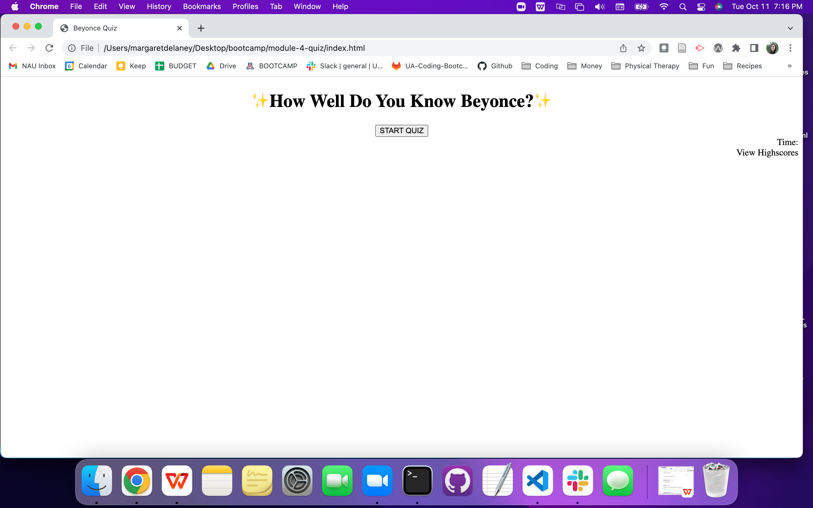
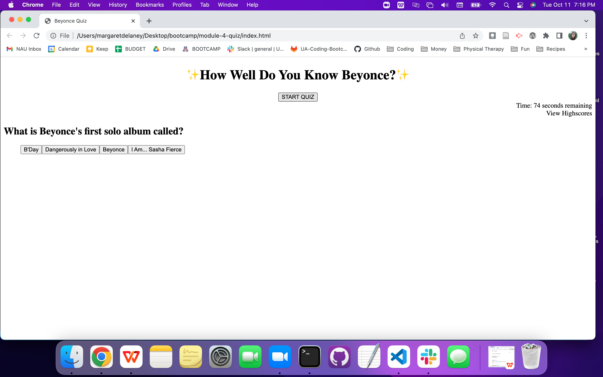

# Module 4 Homework: Beyonce Fact Quiz

## Description

This project called for using HTML, CSS and Javascript to create a functioning quiz, including a timer that counted down at the start of the quiz (and would penalize you for wrong answers by decrementing the time), the first question populating with the start button, then the following questions populating, and finally a score page populating with a place to enter your initials, and get your score. The quiz was also intended to provide dynamic feedback on right or wrong answer throughout.

This project had the following acceptance criteria:
GIVEN I am taking a code quiz, WHEN I click the start button, THEN a timer starts and I am presented with a question
  - You will notice on the home screen there is a "Start Quiz" button, once clicked, a timer for 75 seconds begins and the first question populates
WHEN I answer a question THEN I am presented with another question
  - Once a button is selected on the first question, you will be presented with the second question
WHEN I answer a question incorrectly, THEN time is subtracted from the clock
  - This part of the code I could not get to work properly, so currently the timer does not decrement the time as intended
WHEN all questions are answered or the timer reaches 0, THEN the game is over
  - If the quetions or answers or the timer runs out, you will see the "All done!" screen appear 
WHEN the game is over, THEN I can save my initials and score
  - I did not get this portion of the code to funciton

## Installation

I began with a skeleton outline of the HTML to hold various divs with different purposes. Ther was a div to hold the start button, timer, question, results and dynamic feedback. The divs were given a class or id to be called into the javascript.

The CSS was simple for this project as the functionality was of greater focus. The CSS was used to make the quiz easily readable and organized on the page, and to hide the results section until called.

In the Javascript, first the various ids and classes in the HTML were called using document.querySelector and stored into variables. I began with creating a "blank question" to make the home screen blank until the "Start Quiz" button was clicked. 

There is an event listener on the "Start Quiz" button that begins the timer, where I used setInterval and clearInterval functions to count down by 1 second from 75 seconds.

At the same time, once "Start Quiz" is clicked, a function revealing the first question populates. An array of questions is established in the javascript, called into the function, and moved through a for loop to populate the next question once the first is completed.

After this, another function was created to populate dynamic feedback to the page after each question, however the function is not working properly in the current state of the project.

Missing installation includes: properly displayed feedback that is correct (currently it all presents as "wrong" even if the correct answer is clicked), does not give the score, and the form for initials to be entered is not present.

## Usage

With the current project, the functioning pieces include the timer, and the questions populating. As a user, you will start the quiz and populate the questions by clicking the "Start Quiz" button.

  

Then the next question populates. At this time, the remaining "All done!" screen does not population until the timer is out.

  

## Credits

I referenced multiple pages on mdn web docs for information on all the quiz components:
- https://developer.mozilla.org/en-US/docs/Web/API/Element/innerHTML
- https://developer.mozilla.org/en-US/docs/Web/API/EventTarget/addEventListener
- https://developer.mozilla.org/en-US/docs/Web/API/setInterval
- https://developer.mozilla.org/en-US/docs/Web/API/Node/textContent
- https://developer.mozilla.org/en-US/docs/Learn/JavaScript/Building_blocks/Events
- https://developer.mozilla.org/en-US/docs/Learn/HTML/Howto/Use_data_attributes
- https://developer.mozilla.org/en-US/docs/Web/API/Window/localStorage

## License

MIT License

Copyright (c) 2022 maggierdelaney

Permission is hereby granted, free of charge, to any person obtaining a copy
of this software and associated documentation files (the "Software"), to deal
in the Software without restriction, including without limitation the rights
to use, copy, modify, merge, publish, distribute, sublicense, and/or sell
copies of the Software, and to permit persons to whom the Software is
furnished to do so, subject to the following conditions:

The above copyright notice and this permission notice shall be included in all
copies or substantial portions of the Software.

THE SOFTWARE IS PROVIDED "AS IS", WITHOUT WARRANTY OF ANY KIND, EXPRESS OR
IMPLIED, INCLUDING BUT NOT LIMITED TO THE WARRANTIES OF MERCHANTABILITY,
FITNESS FOR A PARTICULAR PURPOSE AND NONINFRINGEMENT. IN NO EVENT SHALL THE
AUTHORS OR COPYRIGHT HOLDERS BE LIABLE FOR ANY CLAIM, DAMAGES OR OTHER
LIABILITY, WHETHER IN AN ACTION OF CONTRACT, TORT OR OTHERWISE, ARISING FROM,
OUT OF OR IN CONNECTION WITH THE SOFTWARE OR THE USE OR OTHER DEALINGS IN THE
SOFTWARE.
